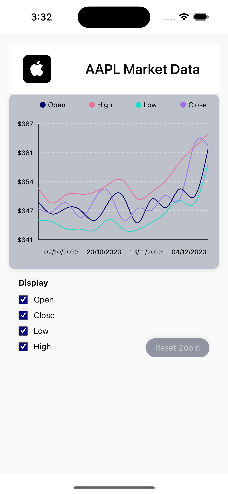

# Market Chart Application

This project is a **React Native application** developed as a **test assignment** to demonstrate skills in building interactive data visualizations with modern mobile technologies. It features a market chart displaying historical stock data for Apple (AAPL), allowing users to visualize key metrics and interact with the chart.

---

## Screenshots

Take a look at these screenshots to see the application in action:

|               **Initial Chart View**               |                **Zoomed Chart View**               |
| :------------------------------------------------: | :------------------------------------------------: |
|  
---

## Implemented Features & Technical Approach

We've successfully implemented the following core features and utilized these technologies to build a robust and interactive market chart:

### **Dynamic Chart Visualization**

* **What was done:** Displays historical stock data for AAPL with multiple lines (Open, Close, Low, High), built with **react-native-svg**, **d3-shape**, **React Native Gesture Handler**, and **Reanimated** for smooth gestures and animations.

### **Toggleable Data Lines**

* **What was done:** Users can select which specific data lines ('Close', 'Low', 'High') are visible on the chart.
* **How it was done:** Used **Redux Toolkit** for managing the `display` state, allowing dynamic rendering of lines based on user preferences.

### **Interactive Zoom & Pan**

* **What was done:** Fully functional **pinch-to-zoom** and **pan** gestures for zooming in and exploring the chart horizontally.
* **How it was done:** Implemented with **React Native Gesture Handler** and **Reanimated** to handle multi-touch gestures, updating the visible data range accordingly.

### **Crosshair / Press State for Data Inspection**

* **What was done:** When a user presses and holds on the chart, a vertical crosshair appears, showing the exact data point under the finger.
* **How it was done:** Custom press handling with precise data interpolation based on finger position.

### **Robust State Management with Redux Toolkit**

* **What was done:** Centralized control of chart state (zoom level, visible lines, etc.).
* **How it was done:** Created `displaySlice` to manage actions like toggling lines or resetting zoom, ensuring clear and predictable state flow.

### **API Integration & Data Handling**

* **What was done:** Fetches historical AAPL stock data from a remote API.
* **How it was done:** Used **Redux Toolkit Query** (`useGetAAPLHistoryQuery`) for efficient data fetching and caching.

### **Error Handling & Loading States**

* Displays loading indicators and error messages using `isLoading`, `isError`, and `error` from RTK Query.

### **Type Safety with TypeScript**

* Fully typed codebase to prevent runtime errors and improve developer experience.

---

## Setup and Installation

Follow these steps to get the project up and running on your local machine:

1. **Clone the repository:**

   ```bash
   git clone <your-repository-url>
   cd <your-project-folder>
   ```

2. **Install dependencies:**

   ```bash
   npm install
   # or
   yarn install
   ```

3. **Start the Expo development server:**

   ```bash
   npx expo start
   ```

4. **Run the application:**

   This project is fully compatible with **Expo Go** — you can launch the app directly by scanning the QR code from the terminal using **Expo Go app on your physical device**.

   > ⚠️ **Important Note:**
   > For **pinch-to-zoom** and **pan gestures**, we highly recommend testing on a **real physical device**, as these multi-touch features may not work properly in emulators or simulators.

---

## Usage

* **Toggle Lines:** You can control the visibility of chart lines via Redux state (extendable with UI buttons or toggles).
* **Zoom & Pan:** Use two-finger pinch to zoom in/out and drag horizontally to pan through data.
* **Data Inspection:** Press and hold to display a vertical crosshair showing precise data values.

---

## Future Enhancements & Areas for Improvement

* True data-driven axis zoom
* Advanced tooltips
* Customizable line styles
* Smooth animated transitions
* Improved gestures (fling, double-tap zoom)
* NativeWind for styling
* Offline caching via Async Storage
* Environment variable support (`.env`)
* Full test coverage (unit + UI)

---

## License

This project is licensed under the **MIT License** – see the [LICENSE](LICENSE) file for details.

---

## Contributing

Pull requests and issues are welcome to improve this project!
